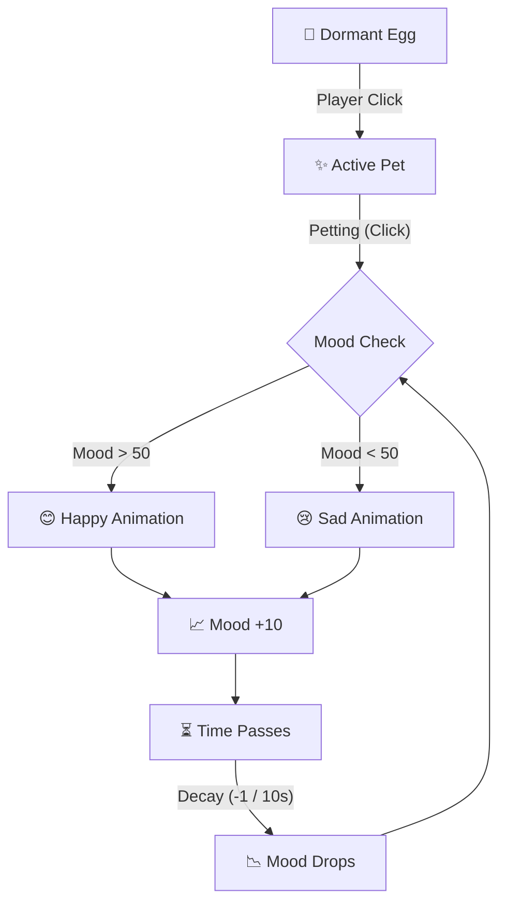
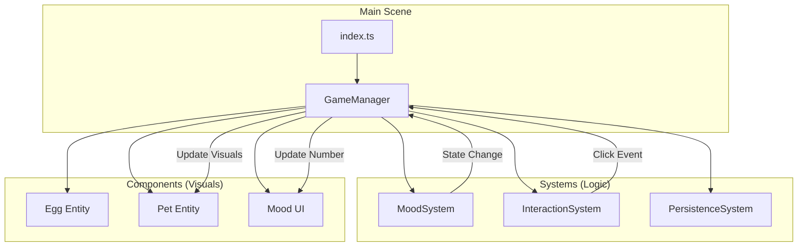

# Holo Pet: Architecture & Execution Plan

## 🌟 A lonely egg needs love to bloom.

A lonely holographic egg floats in the Holodeck. It is dormant until **your touch** wakes it up. Through consistent care and attention, it hatches into a loyal companion that bonds with you forever.

> **Core Promise:** Simple inputs. Immediate emotional feedback. A bond that grows over time.

---

## 🧠 The Logic

### 1. The Loop

_How the game works at the simplest level: Input → Feedback → Consequence._

### 2. The "Lego" Architecture (System Design)

_How the code is organized. Each box is a separate, isolated module._

---

## 🧱 The "Lego" Mental Model

We build this like a Lego set. **Every feature is a separate block.**

1.  **Folder = Category:** `components/` are things you see. `systems/` are things that think.
2.  **File = Feature:** Want to add a new pet? Create `Dragon.ts`. Want to add feeding? Create `FeedingSystem.ts`.
3.  **Plug & Play:** The `GameManager` connects the blocks. If a feature breaks, unplug it; the rest of the game still works.

**Rule:** _No code is better than bad code. Keep it simple, readable, and isolated._

---

## ✅ Hackathon MVP Checklist

### Phase 1: The Heartbeat

- [ ] **Scene Setup:** Place the Holographic Egg in the center (2x2).
- [ ] **Interaction:** Click Egg -> Pet Spawns (Instant gratification).
- [ ] **Feedback:** Click Pet -> Play Animation + Update Mood Number.
- [ ] **The Loop:** Implement Mood Decay (Score goes down over time).

### Phase 2: The Soul

- [ ] **Visual States:** Pet looks Happy (>50) or Sad (<50).
- [ ] **Persistence:** Save Pet State to Firebase (Key: Wallet Address).
- [ ] **Polish:** Add particles/glow to Egg and Pet.

### Phase 3: The Future (Bonus)

- [ ] **Hatching:** Replace instant spawn with 3-stage hatching.
- [ ] **Variety:** Randomize Pet Color/Type on hatch.

## Far future idea collection bucket

- clean up space after longer away
- post sad pet on x after logn away
- different touch zones on the pet to recognise if stroked with pointer
- grooming mechanics should be interactive, not just cick
- walking together
- pets can get older dragon need 1 year to reach full age, girafe 6 mont - dog 3 month - cat 1 month.
- old pets get a beard
- color pattern recognition

