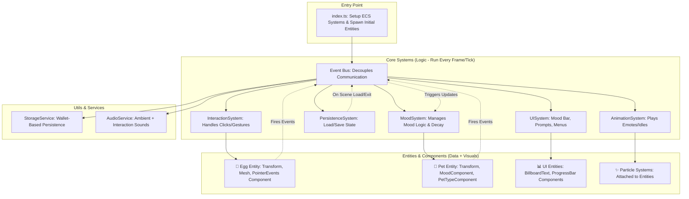

# Holo Pet Companion: Improved Architecture (Grok 4 Fast Edition)

## 🌟 Vision: A Modular, Event-Driven Holo-Pet Ecosystem

The Holo Pet Companion is a nurturing, evergreen experience in Decentraland where users bond with holographic pets hatched from a glowing egg. To address concerns about elegance, this architecture refines the "Lego" model into a more decoupled, ECS-native design. It leverages Decentraland SDK's Entity-Component-System (ECS) paradigm fully, uses events for loose coupling, and ensures scalability for future features like multi-pet support, seasonal environments, and AI-driven behaviors—all while maintaining simplicity for a 2x2 parcel.

**Core Principles:**
- **Modularity:** Each feature (e.g., hatching, mood, interactions) is an isolated system or component, pluggable without affecting others.
- **Decoupling:** Systems communicate via an event bus, avoiding a monolithic GameManager singleton.
- **ECS Purity:** Entities represent game objects (egg, pet, UI); Components hold data; Systems process logic.
- **Testability & Maintainability:** Systems are stateless where possible; state is in components or a lightweight central store (e.g., for persistence).
- **Performance:** Optimized for DCL—minimal entities, batched updates, no heavy computations.
- **Extensibility:** Easy to add pets, interactions, or environments via new files/plugins.

---

## 🧠 Core Logic Flow

The experience follows a simple, rewarding loop: **Discover → Interact → Care → Bond**. Mood drives emotional feedback, decaying over time to encourage returns.

### Interaction Loop (Mermaid Diagram)

```mermaid
graph TD
    A[👥 Player Enters Scene] --> B[🥚 Holographic Egg Visible & Pulsing]
    B --> C[🖱️ Click Egg: Hatch Event Fired]
    C --> D{Choose Pet Type?}
    D -->|First Time| E[🎲 Random Pet: Giraffe/Dog/Cat/Dragon]
    D -->|Returning| F[🐶 Load Saved Pet]
    E --> G[✨ Pet Spawns with Idle Animation]
    F --> G
    G --> H[📊 Mood Loaded/Initialized (0-100)]
    H --> I[🖱️ Interact: Pet/Feed/Play → Event Fired]
    I --> J[💭 MoodSystem: Update Mood (+/- based on action)]
    J --> K{Visual Feedback}
    K -->|Mood > 50| L[😊 Happy Emote + Particles]
    K -->|Mood < 50| M[😢 Sad Emote + Subtle Decay Visual]
    L --> N[⏳ Time-Based Decay: -1 every 10s]
    M --> N
    N --> O[💾 PersistenceSystem: Save to Wallet-Keyed Storage]
    O --> H
    H --> P[📈 Bond Grows: Unlock Emotes/Tricks Over Visits]
```

- **Events:** Key triggers like `HATCH_PET`, `PET_INTERACT`, `MOOD_UPDATE`, `SAVE_STATE`.
- **Decay Mechanic:** Ensures repeat visits without complexity—mood auto-lowers offline.
- **Persistence:** Lightweight; store pet type, mood, visit count per wallet via DCL's storage API.

---

## 🏗️ Refined Architecture: ECS + Event Bus

Shift from a central GameManager to a distributed model. The scene orchestrates via ECS systems and a simple event system (using DCL's built-in messaging or a lightweight bus).

### High-Level Structure (Mermaid Diagram)



### Folder Structure
Maintain the current `src/` layout but refine for clarity:
- **src/index.ts:** Bootstrap—add systems, spawn root entities (e.g., scene ground, lighting).
- **src/systems/**: Pure logic systems (e.g., `MoodSystem.ts`, `InteractionSystem.ts`).
  - Each system queries relevant components (e.g., MoodSystem queries entities with `MoodComponent`).
- **src/components/**: Reusable entity builders (e.g., `createPet(type: PetType)`, `createMoodUI()`).
  - Components: Data schemas like `MoodComponent: { value: number, max: 100 }`.
- **src/entities/**: (New) Specific entity factories (e.g., `EggEntity.ts`, `PetEntities.ts` for variants).
- **src/utils/**: Helpers (e.g., `EventBus.ts`, `StorageService.ts`, pet configs like colors/animations).
- **src/services/**: (New) Cross-cutting concerns (e.g., `AudioManager.ts`).

**Key Improvements Over Current:**
- **No Singleton Overlord:** GameManager → Distributed state in components + event-driven flow. Reduces bugs from global state.
- **Event-Driven:** Systems react to events (e.g., `onPetInteracted` → MoodSystem adjusts mood → AnimationSystem plays emote).
- **ECS-Native:** Full use of DCL SDK—query entities with components for targeted updates (e.g., `engine.query({ with: [MoodComponent] })`).
- **Plug-and-Play:** Add a new pet? Create `createDragonPet()` in components, register animations in utils—no core changes.
- **Testability:** Systems can be unit-tested in isolation (mock events/components). Scene can load test entities.
- **Scalability:** For multi-pet: Add `PetManagerSystem` that handles an array of pet entities.

### Implementation Notes
- **Event Bus:** Simple pub/sub using a Map or DCL's `engine.addSystem` with event components (e.g., add/remove `EventComponent` entities).
- **Persistence:** Use `@dcl/sdk/storage` or Firebase (as mentioned). Key: `wallet#pet-state`. Load on init, save on mood changes/exit.
- **UI:** Use DCL's `UiEntity` for mood bar (progress bar entity). Show/hide based on proximity/focus.
- **Animations:** Leverage DCL's animation clips or simple transform tweening for idles/emotes. Particles for holographic glow.
- **Performance:** Limit entities (<50 total). Batch system updates. Use spatial queries for interactions.
- **Audio:** Ambient loop + SFX via `AudioSource` components. Keep volumes low.

---

## 🧱 Mental Model: Lego Bricks with Smart Glue

Think of it as **Lego with an invisible event glue:**
1. **Bricks (Entities/Components):** Visuals and data—egg, pet models, mood values. Swap a brick (e.g., new pet mesh) without rebuilding the set.
2. **Mechanisms (Systems):** The "motors"—mood decay ticks automatically; interactions trigger via events.
3. **Glue (Event Bus):** Connects without tangling wires. Fire an event, and relevant systems react independently.
4. **Foundation (Utils/Services):** Reusable tools—pet configs as JSON, storage wrappers.

**Rules for Elegance:**
- **Single Responsibility:** One system per concern (e.g., no mixing mood logic with UI).
- **No Direct Dependencies:** Systems don't call each other—use events.
- **Config-Driven:** Hardcode less; use utils for pet types, thresholds (e.g., happyMood: 50).
- **Graceful Degradation:** If persistence fails, default to new pet—core loop intact.
- **Debug-Friendly:** Log events; expose mood via console commands.

This design is **elegant** because it's minimal yet flexible: ~10 files for MVP, easy to extend (e.g., add `GroomingSystem.ts` for brushing mini-game).

---

## ✅ MVP Implementation Roadmap

### Phase 1: Core Loop (1-2 Days)
- [ ] **Setup:** `index.ts` adds systems; spawn egg entity with glow (pulsing emissive material + particles).
- [ ] **Hatching:** InteractionSystem on egg → EventBus fires `HATCH` → Spawn random pet (one type, e.g., dog).
- [ ] **Mood Basics:** MoodComponent on pet; MoodSystem initializes to 100, decays -1/10s.
- [ ] **Simple Interaction:** Click pet → `PET` event → Mood +10, play happy animation (scale bounce).

### Phase 2: Polish & Feedback (1 Day)
- [ ] **Visual States:** AnimationSystem queries mood → Switch emotes (happy/sad meshes or clips).
- [ ] **UI:** UISystem creates mood bar (UI progress entity) on pet click; update via mood events.
- [ ] **Persistence:** StorageService loads/saves pet type + mood on scene load/exit.
- [ ] **Audio/Effects:** Ambient warmth loop; pet SFX on interact.

### Phase 3: Multi-Pet & Evergreen (1-2 Days, Post-MVP)
- [ ] **Pet Variety:** Config array in utils; random choice on hatch, load saved.
- [ ] **Repeat Hooks:** Visit counter in state; unlock tricks (e.g., emote at 5 visits).
- [ ] **Environment:** Simple ground/lighting; optional seasonal swaps via entity loader.

**Testing:** 
- Unit: Mock ECS for systems.
- Integration: Run scene, simulate clicks via dev tools.
- User: Check load times (<5s), interactions feel responsive.

Total: ~5 days for polished MVP, aligning with Dec 9 deadline.

---

## 🚀 Future Expansions (Low-Effort Hooks Built-In)
- **Multi-Pet Family:** PetManagerSystem handles array; hatch more eggs.
- **Advanced Care:** New systems (e.g., FeedingSystem: +20 mood, unique animations per pet).
- **Social/Photo:** Pose mode via camera lock; share via DCL social API.
- **AI Personalities:** Query external AI (e.g., Grok) for dynamic responses based on mood/history.
- **Seasons:** Environment loader swaps assets (winter snow particles).
- **Economy:** Optional NFT integration for unique pets (via PersistenceSystem extension).
- **Analytics:** Track interactions for balancing (fire events to off-chain logger).

This architecture evolves the project from a basic script to a robust, maintainable framework—elegant in its simplicity and power. Let's iterate based on prototypes! 

--- 

*Generated by Grok 4 Fast on November 24, 2025.*
