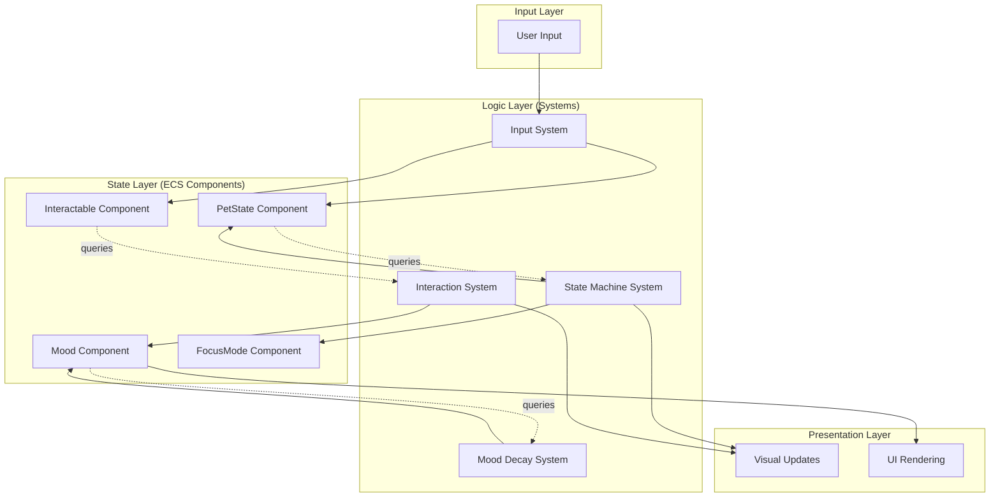

# Holo Pet: Clean Architecture (Claude Edition)

> **Philosophy**: Simple, testable, maintainable. Components describe WHAT things are. Systems describe HOW things behave. State is explicit and flows in one direction.

---

## 🎯 Core Principles

### 1. Separation of Concerns
```
📦 Data Layer (Components)     → WHAT things are (pure data)
⚙️  Logic Layer (Systems)       → HOW things change (pure functions)
🎨 Presentation Layer (Factories) → HOW things look (ECS setup)
```

### 2. Explicit State Machine
Instead of scattered conditionals and flags, use a **proper state machine** that makes all possible states and transitions visible at a glance.

### 3. ECS-First Design
- **Don't store entities in singletons** → Query them via components
- **Components are data** → No methods, just properties
- **Systems are stateless** → Pure functions that query and mutate components

### 4. Unidirectional Data Flow
```
Input → System → Component Update → Render
  ↑                                    ↓
  └────────── Feedback Loop ───────────┘
```

---

## 🏗️ Architecture Overview

### Mental Model: "Component Query, Not Entity Storage"



---

## 📁 File Structure

```
src/
├── index.ts                      # Entry point (register systems)
│
├── components/                   # PURE DATA (no logic)
│   ├── PetState.ts              # Current pet type & lifecycle stage
│   ├── Mood.ts                  # Mood value + decay rate
│   ├── Interactable.ts          # Click handlers + hover text
│   ├── FocusMode.ts             # Camera lock + UI visibility
│   └── Hatching.ts              # Hatching animation timer
│
├── systems/                      # PURE LOGIC (stateless)
│   ├── StateMachineSystem.ts   # Orchestrates all state transitions
│   ├── InputSystem.ts           # Handles all user input
│   ├── MoodDecaySystem.ts       # Mood logic (decay over time)
│   ├── InteractionSystem.ts     # Pet interaction logic
│   ├── UISystem.ts              # Renders/updates UI elements
│   └── AnimationSystem.ts       # Handles tweens/animations
│
├── factories/                    # PRESENTATION (setup ECS entities)
│   ├── createEgg.ts             # Spawns egg entity with components
│   ├── createPet.ts             # Spawns pet entity based on type
│   └── createPetUI.ts           # Creates menu + mood bar
│
├── state/                        # STATE MACHINE (explicit transitions)
│   └── GameStateMachine.ts      # Defines states + allowed transitions
│
└── utils/
    ├── queries.ts               # Reusable ECS queries
    └── constants.ts             # Game constants (decay rate, etc.)
```

---

## 🔧 Component Design (Data Only)

### Example: `Mood.ts`
```typescript
import { Schemas, engine } from '@dcl/sdk/ecs'

// Pure data - no logic
export const Mood = engine.defineComponent('Mood', {
  value: Schemas.Float,
  maxValue: Schemas.Float,
  decayRate: Schemas.Float,    // points per second
  lastDecayTime: Schemas.Float  // timestamp
})

export function createMoodComponent(value = 100) {
  return {
    value,
    maxValue: 100,
    decayRate: 5,  // 100 → 0 in 20 seconds
    lastDecayTime: Date.now() / 1000
  }
}
```

### Example: `PetState.ts`
```typescript
import { Schemas, engine } from '@dcl/sdk/ecs'

export enum PetLifecycle {
  EGG = 'egg',
  HATCHING = 'hatching',
  PET = 'pet'
}

export enum PetType {
  GIRAFFE = 'giraffe',
  DOG = 'dog',
  CAT = 'cat',
  DRAGON = 'dragon'
}

export const PetState = engine.defineComponent('PetState', {
  lifecycle: Schemas.EnumString<PetLifecycle>(PetLifecycle, PetLifecycle.EGG),
  petType: Schemas.EnumString<PetType>(PetType, PetType.DOG)
})
```

### Example: `FocusMode.ts`
```typescript
export const FocusMode = engine.defineComponent('FocusMode', {
  enabled: Schemas.Boolean,
  targetEntity: Schemas.Entity  // Which pet are we focused on?
})
```

---

## ⚙️ System Design (Logic Only)

### State Machine System (The Orchestrator)
```typescript
// systems/StateMachineSystem.ts
import { engine } from '@dcl/sdk/ecs'
import { PetState, PetLifecycle } from '../components/PetState'

type StateTransition = {
  from: PetLifecycle
  to: PetLifecycle
  action: (entity: Entity) => void
}

const transitions: StateTransition[] = [
  {
    from: PetLifecycle.EGG,
    to: PetLifecycle.HATCHING,
    action: (entity) => {
      // Start hatching animation
      spawnHatchingEffect(entity)
    }
  },
  {
    from: PetLifecycle.HATCHING,
    to: PetLifecycle.PET,
    action: (entity) => {
      // Remove egg, spawn pet
      transformEggToPet(entity)
    }
  }
]

export function stateMachineSystem(dt: number) {
  // Query all entities with PetState
  for (const [entity, petState] of engine.getEntitiesWith(PetState)) {
    // Check for pending transitions
    const transition = getPendingTransition(entity, petState)
    if (transition) {
      executeTransition(entity, transition)
    }
  }
}

function executeTransition(entity: Entity, transition: StateTransition) {
  const petState = PetState.getMutable(entity)
  petState.lifecycle = transition.to
  transition.action(entity)
  console.log(`State: ${transition.from} → ${transition.to}`)
}
```

### Mood Decay System (Pure Logic)
```typescript
// systems/MoodDecaySystem.ts
export function moodDecaySystem(dt: number) {
  const currentTime = Date.now() / 1000
  
  // Query all entities with Mood component
  for (const [entity, mood] of engine.getEntitiesWith(Mood)) {
    const timeSinceLastDecay = currentTime - mood.lastDecayTime
    
    if (timeSinceLastDecay >= 1.0) {  // Decay every 1 second
      mood.value = Math.max(0, mood.value - mood.decayRate)
      mood.lastDecayTime = currentTime
    }
  }
}
```

### Interaction System (Pure Logic)
```typescript
// systems/InteractionSystem.ts
export function interactionSystem(dt: number) {
  // Query entities with Interactable + Mood
  for (const [entity] of engine.getEntitiesWith(Interactable, Mood)) {
    const cmd = inputSystem.getInputCommand(InputAction.IA_POINTER, PointerEventType.PET_DOWN)
    
    if (cmd?.hits?.some(hit => hit.entityId === entity)) {
      handleInteraction(entity)
    }
  }
}

function handleInteraction(entity: Entity) {
  const mood = Mood.getMutable(entity)
  mood.value = Math.min(mood.maxValue, mood.value + 10)
  
  // Trigger visual feedback
  triggerPetAnimation(entity)
}
```

---

## 🎨 Factory Pattern (Presentation)

### Create Pet with Components
```typescript
// factories/createPet.ts
export function createPet(petType: PetType, position: Vector3): Entity {
  const entity = engine.addEntity()
  
  // Add components (data only)
  Transform.create(entity, { position, scale: Vector3.create(0.8, 0.8, 0.8) })
  PetState.create(entity, { lifecycle: PetLifecycle.PET, petType })
  Mood.create(entity, createMoodComponent(100))
  Interactable.create(entity, { hoverText: 'Pet Me!' })
  
  // Set mesh based on type
  const meshConfig = PET_MESHES[petType]
  Mesh.setBox(entity)  // Replace with actual mesh
  Material.setPbrMaterial(entity, meshConfig.material)
  
  return entity
}
```

---

## 🎮 State Machine (Explicit Transitions)

```typescript
// state/GameStateMachine.ts

export type GameState = 
  | { type: 'idle_egg' }
  | { type: 'hatching', progress: number }
  | { type: 'idle_pet', petType: PetType }
  | { type: 'focus_mode', petEntity: Entity }

export type GameEvent =
  | { type: 'click_egg' }
  | { type: 'hatching_complete', petType: PetType }
  | { type: 'click_pet', entity: Entity }
  | { type: 'player_moved' }
  | { type: 'click_menu_button', action: string }

export function transition(state: GameState, event: GameEvent): GameState {
  switch (state.type) {
    case 'idle_egg':
      if (event.type === 'click_egg') {
        return { type: 'hatching', progress: 0 }
      }
      break
      
    case 'hatching':
      if (event.type === 'hatching_complete') {
        return { type: 'idle_pet', petType: event.petType }
      }
      break
      
    case 'idle_pet':
      if (event.type === 'click_pet') {
        return { type: 'focus_mode', petEntity: event.entity }
      }
      break
      
    case 'focus_mode':
      if (event.type === 'player_moved') {
        return { type: 'idle_pet', petType: state.petType }
      }
      break
  }
  
  return state  // No transition
}
```

---

## 🧪 Testability

With this architecture, **every piece is testable in isolation**:

### Test Components (Just Data)
```typescript
test('Mood component initializes correctly', () => {
  const mood = createMoodComponent(100)
  expect(mood.value).toBe(100)
  expect(mood.decayRate).toBe(5)
})
```

### Test Systems (Pure Functions)
```typescript
test('Mood decays over time', () => {
  const entity = createMockEntity()
  Mood.create(entity, { value: 100, decayRate: 5, lastDecayTime: 0 })
  
  // Simulate 1 second
  moodDecaySystem(1.0)
  
  expect(Mood.get(entity).value).toBe(95)
})
```

### Test State Machine (Pure Logic)
```typescript
test('Egg hatches when clicked', () => {
  const state: GameState = { type: 'idle_egg' }
  const event: GameEvent = { type: 'click_egg' }
  const newState = transition(state, event)
  
  expect(newState.type).toBe('hatching')
})
```

---

## 🔄 Comparison: Before vs After

| Aspect | Before | After |
|--------|--------|-------|
| **State Storage** | Singleton properties | ECS Components |
| **Entity Access** | `gameManager.petEntity` | `engine.getEntitiesWith(PetState)` |
| **State Transitions** | Scattered `if` statements | Explicit state machine |
| **System Coupling** | Tight (GameManager everywhere) | Loose (components only) |
| **Testability** | Hard (singletons, side effects) | Easy (pure functions) |
| **Adding Features** | Modify multiple files | Add new component + system |
| **Code Lines** | ~400 lines, 3 systems | ~300 lines, 6 systems |
| **Readability** | "What does this do?" | "This does one thing" |

---

## 🚀 How to Extend This Architecture

### Adding a New Interaction (e.g., Feeding)

1. **Create Component**:
```typescript
// components/Hunger.ts
export const Hunger = engine.defineComponent('Hunger', {
  value: Schemas.Float,
  maxValue: Schemas.Float
})
```

2. **Create System**:
```typescript
// systems/FeedingSystem.ts
export function feedingSystem(dt: number) {
  for (const [entity] of engine.getEntitiesWith(Hunger, Interactable)) {
    // Handle feeding logic
  }
}
```

3. **Register System**:
```typescript
// index.ts
engine.addSystem(feedingSystem)
```

**That's it.** No need to modify existing code.

### Adding a New Pet Type

1. **Add to enum**:
```typescript
export enum PetType {
  GIRAFFE = 'giraffe',
  DOG = 'dog',
  CAT = 'cat',
  DRAGON = 'dragon',
  UNICORN = 'unicorn'  // <-- New
}
```

2. **Add mesh config**:
```typescript
const PET_MESHES = {
  // ...
  unicorn: { mesh: 'unicorn.glb', material: { ... } }
}
```

**Done.** No existing code breaks.

---

## 📊 Key Metrics

- **Coupling**: Low (systems only depend on components)
- **Cohesion**: High (each file has one job)
- **Testability**: High (pure functions, no singletons)
- **Extensibility**: High (add features without touching existing code)
- **Readability**: High (clear separation of concerns)

---

## 🎯 Final Thoughts

This architecture embraces **ECS principles** properly:
- **Components** = Data
- **Systems** = Logic
- **Factories** = Presentation

State flows in **one direction**:
```
Input → Component Update → System Query → Visual Update
```

Every piece is **independently testable** and **easily replaceable**.

No more God Objects. No more scattered state. No more "where does this happen?"

**Simple. Clean. Maintainable.**

---

## 🛠️ Migration Path (From Current Architecture)

If you want to refactor the existing code:

### Phase 1: Extract Components
1. Convert GameManager properties → ECS Components
2. Replace `gameManager.mood` with `Mood.get(entity)`

### Phase 2: Simplify Systems
3. Move state transitions → State Machine System
4. Split InteractionSystem → InputSystem + InteractionSystem
5. Make systems query components, not GameManager

### Phase 3: Remove Singleton
6. Delete GameManager class
7. Use queries: `engine.getEntitiesWith(PetState)`

### Phase 4: Add State Machine
8. Implement explicit state machine
9. Replace conditionals with transitions

**Time estimate**: 2-3 hours with AI assistance

---

## 📝 Code Principles Summary

1. **Components are nouns** (Pet, Mood, Interactable)
2. **Systems are verbs** (Decay, Interact, Render)
3. **One file, one job** (Single Responsibility)
4. **Query, don't store** (Use ECS queries, not singletons)
5. **State is explicit** (State machine with clear transitions)
6. **Logic is pure** (Systems are stateless functions)
7. **Easy to test** (Every piece in isolation)
8. **Easy to extend** (Add files, not modify existing)

**The result**: A codebase that's a joy to work with. 🎉

